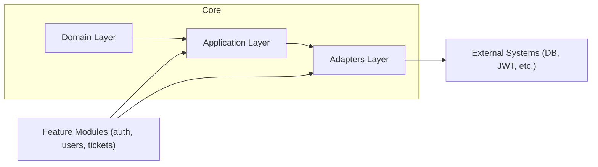

# Helpdesk API Architecture Overview

Helpdesk API is a backend service built with NestJS, following Domain-Driven Design (DDD) principles. It provides authentication, user management, and ticketing features for helpdesk systems.

## Documentation Structure

- [Project Structure & DDD Layering](./docs/structure.md):
  - Detailed explanation of the folder structure and DDD layering.
- [Architectural Patterns & Code Examples](./docs/patterns.md):
  - Concrete code examples for Dependency Injection, Repository, Use Case, and Adapter patterns.


## Main Architectural Concepts

- **Domain Layer**: Business entities, value objects, and domain logic.
- **Application Layer**: Use cases, application services, and ports (interfaces for dependencies).
- **Adapters Layer**: Infrastructure and external interfaces (DB, JWT, etc.).
- **Modules**: Feature modules (auth, users, tickets) with controllers and DI setup.

### Architecture Overview Diagram



For a deeper dive into the structure and patterns, see the linked documentation above.

---

## Further Reading

- [Project Structure & DDD Layering](./docs/structure.md)
- [Architectural Patterns & Code Examples](./docs/patterns.md)

---

*Consider adding module-specific docs (e.g., `docs/modules/auth.md`) and diagrams for visual clarity.*

## 5. Setup and Usage

### Installation
```bash
npm install
```

### Running
```bash
# Creating containers
docker-compose up
# Run in watch mode
npm run start:dev
```

### Environment
- Configure `.env` or `.env.test` for environment variables (DB, JWT, etc).

## 6. Testing

- **Unit tests**: `npm run test`
- **E2E tests**: `npm run test:e2e`
- **Coverage**: `npm run test:cov` (see `coverage/` folder)

## 7. Contributing & License

- Contributions welcome! See guidelines in the repository.
- License: UNLICENSED
