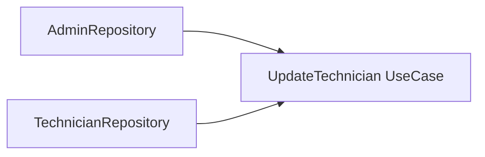
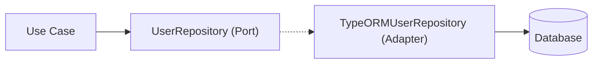
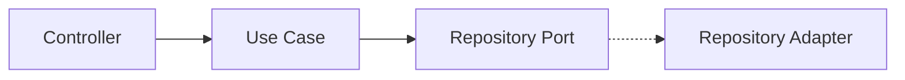
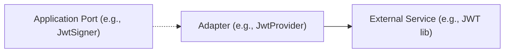

# Patterns in the Project

**[← Back to Structure](./structure.md) | [Architecture Overview →](../README.md)**

This document explains key architectural patterns used in the project, with real code examples.


## Dependency Injection

Dependency Injection decouples classes from their dependencies. Dependencies are provided via constructors.



**Example:**

```typescript
export class UpdateTechnician implements UpdateTechnicianUseCase {
  constructor(
    private readonly adminRepository: AdminRepository,
    private readonly technicianRepository: TechnicianRepository,
  ) {}
  // ...
}
```


## Repository Pattern

Repositories abstract data access, providing a collection-like interface for domain entities.



**Port (Interface):**
```typescript
export interface UserRepository {
  findById(id: string): Promise<UserEntity | null>;
  findByEmail(email: string): Promise<UserEntity | null>;
  save(user: UserEntity): Promise<void>;
}
```

**Adapter (Implementation):**
```typescript
export class TypeORMUserRepository implements UserRepository {
  private readonly userRepo: Repository<User>;
  constructor(dataSource: DataSource) {
    this.userRepo = dataSource.getRepository(User);
  }
  async findById(id: string): Promise<UserEntity | null> {
    const user = await this.userRepo.findOne({ where: { id } });
    if (!user) return null;
    return user.toDomain();
  }
  // ...
}
```


## Use Case Pattern

Use cases encapsulate application logic and orchestrate domain operations.



**Example:**
```typescript
export class UpdateTechnician implements UpdateTechnicianUseCase {
  constructor(
    private readonly adminRepository: AdminRepository,
    private readonly technicianRepository: TechnicianRepository,
  ) {}
  async execute(input: UpdateTechnicianInput): Promise<Result<void>> {
    // ...
  }
}
```


## Adapter Pattern

Adapters implement interfaces (ports) to connect the application to external systems or infrastructure.



**Example:**
```typescript
export class JwtProvider implements JwtSigner, JwtVerifier {
  private readonly _secret: string;
  constructor(private readonly confProvider: ConfProvider) {
    this._secret = this.confProvider.get('auth.secret');
  }
  async sign(payload: Record<string, unknown>, ttl: TimeDuration): Promise<string> {
    // ...
  }
  async verify<T = Record<string, unknown>>(token: string) {
    // ...
  }
}
```

---


---

For project structure and layering, see [structure.md](./structure.md).
