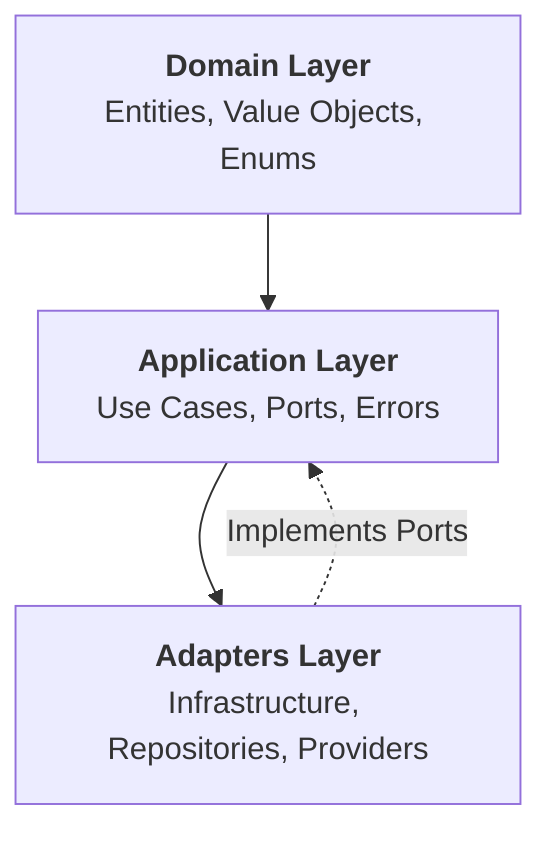

# Project Structure and DDD Layering

**[← Back to Architecture Overview](../README.md) | [See Patterns & Examples →](./patterns.md)**

This document details the folder structure and Domain-Driven Design (DDD) layering of the project. It serves as a reference for understanding how the codebase is organized and how responsibilities are separated.

## Top-Level Structure

```
├── src/
│   ├── main.ts
│   ├── @core/
│   ├── modules/
│   └── @types/
├── database/
├── docs/
├── test/
├── package.json
├── tsconfig.json
└── ...
```

- **src/**: Main application source code
- **database/**: Data source configuration and migrations
- **docs/**: Documentation
- **test/**: Test files and setup


## DDD Layers in `src/@core`



```
src/@core/
├── adapters/         # Infrastructure and external interfaces
├── application/      # Application logic (use cases, ports, errors)
├── domain/           # Domain entities, value objects, enums
```

### Layer Descriptions

- **Domain Layer (`domain/`)**: Contains business entities, value objects, and domain logic. Example:
  - `src/@core/domain/entities/user.entity.ts`
  - `src/@core/domain/value_objects/email.vo.ts`

- **Application Layer (`application/`)**: Contains use cases, application services, and ports (interfaces for dependencies). Example:
  - `src/@core/application/usecases/create_user.usecase.ts`
  - `src/@core/application/ports/user_repository.port.ts`

- **Adapters Layer (`adapters/`)**: Implements interfaces defined in the application layer, connects to infrastructure (DB, external services, etc.). Example:
  - `src/@core/adapters/repositories/typeorm/user_repository.ts`
  - `src/@core/adapters/jwt/jwt_provider.ts`

## Modules

The `src/modules/` directory contains feature modules, each with its own controllers, services, and DTOs. Example:

```
src/modules/
├── auth/
│   ├── auth.controller.ts
│   ├── auth.module.ts
│   └── dtos/
├── tickets/
├── users/
└── @shared/
```

- **@shared/**: Shared decorators, middlewares, and types used across modules.

## Example: User Flow

1. **Controller** (e.g., `users.controller.ts`) receives a request.
2. **Use Case** (e.g., `create_user.usecase.ts`) is invoked.
3. **Repository Port** (e.g., `user_repository.port.ts`) is used by the use case.
4. **Repository Adapter** (e.g., `user_repository.ts`) implements the port and interacts with the database.

---


---

For more on patterns and code examples, see [patterns.md](./patterns.md).
